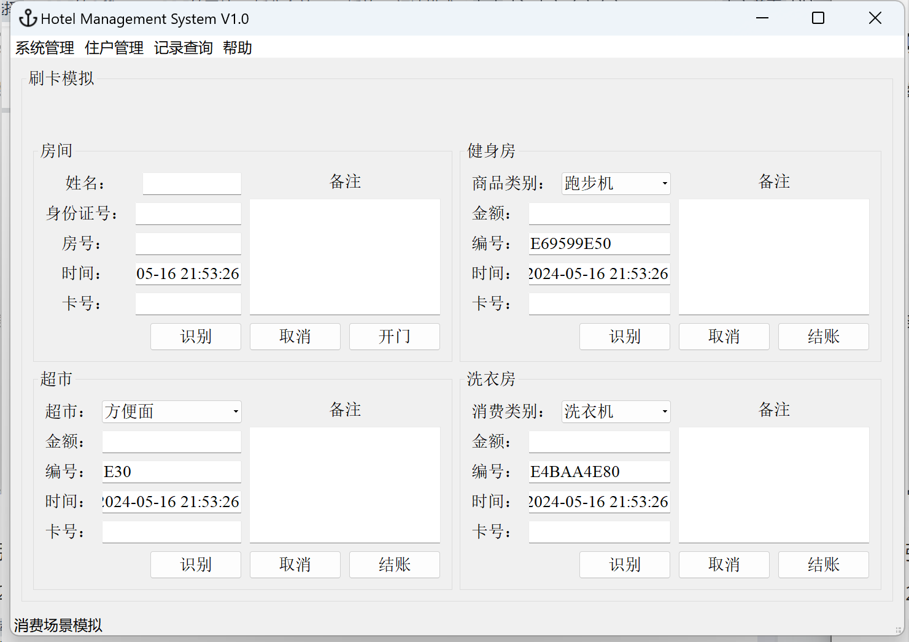

## HUST物联网21级RFID实验

前言：

为什么要写这个仓库？

目标人群主要是，大学三年多，一次课设都没有认真做过的同学。

有时候也不是我们不想做，只是，有些课设实在无从下手，比如说HUST数据结构课设，哥们刚学会1+1就要做编译器/数独，我都不知道从哪里开始写。


### 1. 仓库介绍

Lab 1 到 Lab 4 都可以按照实验手册上面的步骤一步一步做，此处不再赘述。

Lab 5 我要做的是酒店管理系统，由Lab2中的校园一卡通换皮改造而成。


另外一个题目是图书管理系统，难度我认为会相对低一些，原因有两个：一是Lab3的完成度会相比Lab2更加高一些，二是github上面有学长/学姐已经摆了图书管理系统的代码，大家也可以站在巨人的肩膀上。

（酒店管理系统好像也有，但是是用visual studio环境的，一旦涉及环境，哥们就开始有点抗拒，所以我就没有看那个仓库，直接搜 hust RFID 你们就会看到4个链接的，2个图书1个酒店1个空）


### 2. 环境说明

**软件平台**

因为实验室（南一楼116）的Qt好像是32 bit的，我也不太懂32 bit和64 bit的区别究竟在哪里，所以我沿用**Qt 5.9 32bit**的版本。

数据库用的是**Qt原生的sqlite**。为什么不用MySQL？MySQL需要配置环境，我尝试去做了一晚上＋一个早上，连上数据库了，但是创建表出现报错，我没有太多的时间去解决问题，及时止损，无痛sqlite就好了，又不是不能用！

>  注意，原生的sqlite有一个问题，假如你已经创建了一个表，但是你后来要修改表头，就比如说，你原本想创建的表是 create table a (roomId varchar); 然后后来你要修改成 create table a (roomId varchar, cardId varchar); 记得把原来的表删除，再重新创建，不然你只能一直看到你的旧表。这个相当重要，我在处理Bug的时候有3次都是这个问题。

另外，我使用 Navicat Premium 16 来可视化管理数据库，在你微信搜一搜可以找到很多“破解版”。

Qt 界面在**win 11**上应该是可以完整的显示出来并且没有太多Bug，比原来Lab 2的各种被挤到变形的界面应该是有所改善。

应该没有别的了吧，感觉我一直来来去去都是在Qt里

**硬件平台：**

博创智联科技有限公司 UP-RFID-S型RFID综合实验教学平台 **13.56MHz 模块**。

Mifare 1卡，实验箱里面会用黑色笔标注14443。


### 3. 项目结构


Headers 是头文件，Sources是源代码，Forms 是ui文件，Resources 存放需要用到的图片等，database目录是数据库交互文件，pages是各功能实现文件，serialThread是和硬件交互的文件，tools是各种杂七杂八处理连接等的文件。


### 4. 功能介绍

- 数据库
  - 建立4张表
    - CustomerTableModel 客人基本信息表（卡号、姓名、手机号、…、是否激活）；
    - CustomerRoomTableModel 客人房间开启信息表（卡号、打开时间）；
    - RoomTableModel  酒店房间信息表（房间编号、面积、…）；
    - WriteOffTableModel 退房表（卡号、时间、信息备注）
    - **CardTableModel  房间与卡绑定信息表（序号、卡号、房间号、状态标志）；**
    - 不出意外，你还会看到其它表，那些都是原来Lab 2留下来的。假如没有Bug的话，删掉他们是没有Bug的。（是不是说得很有道理）但是它们在我模仿学习的过程中着实发挥了非常大的作用。
- 实现功能
  - 客人发卡管理；
  - 客人门禁卡注销管理，清楚卡内所有信息；
  - 客人续住管理，续住时，重新设置卡内的起止时间信息；
  - 客人开启进出房间信息管理，统计、查询

- 功能演示（只演示在Lab 2基础上修改过的功能）

  1.发卡管理

  ​        除了界面的修改，这里我添加房间的有效期时间限制，假如在卡的有效期以外，这张卡将不能在后面的刷卡模拟正常使用。

  2.注销管理

  

  ​        这里其实耍了个小聪明，就是把退房和挂失放到一起，在原因里面体现区别。

  ​        因为按照我们的习惯，我们肯定不可能记得这张卡的卡号，除非这是不记得卡号将取不到内含千万的银行卡里面的钱（doge）

  ​        所以把卡号换成房号，只要输入房号我就能成功注销这张卡。

  3.刷卡

  

  ​        左上角这个房间的刷卡模块，就是当识别到卡号的时候，把卡里的信息发到前端，而不是像另外三个模块一样或是Lab 2一样，需要手动输入金额/选取消费类别。

  ​        然后这个开门其实也不是真正的开门，只要你去找源代码你就会发现，这只是我设置了程序大叫“开门”，如开，开了吗，没有开，但是添加到记录里面了，在后面的记录查询能查到。

  4.记录查询

  

  ​        这个没什么好说的，所见即所得。哦，话说假如真的有人clone了这个仓库，大概会把数据库也下载下来，这就会看到我、我对象和我舍友的名字在里面，不过也没有什么敏感信息，我懒得删。

  5.关于

  

  ​        别忘了修改关于，到时候演示的时候甘老师看到了就问你他是谁。


### 5. 关键代码说明

每个注释都是我的血汗，基本上都踩过坑，或者说基本上你只需要理解这些代码就OK了。

- 注册

``` cpp
// registorwidge.cpp

void RegistorWidget::on_btn_Register_clicked()
{
    // 关联.ui里面的对象
    QMessageBox message;
    QString userName = ui->lineEdit_Name->text();
    QString idCard = ui->lineEdit_IdCard->text();
    QString roomType = ui->comboBox_RoomType->currentText();
    QDateTime checkInTime = ui->dateTimeEdit_checkInTime->dateTime();
    QDateTime checkOutTime = ui->dateTimeEdit_checkOutTime->dateTime();
    QString personRemark = ui->textEdit_PersonMark->toPlainText();
    QString cardRemark = ui->textEdit_CardMark->toPlainText();
    QString cardId = ui->lineEdit_CardId->text();
    QString roomId = ui->lineEdit_RoomId->text();

    message.setStandardButtons(QMessageBox::Yes);
    message.setWindowTitle(tr("温馨提示"));
    message.setIcon(QMessageBox::Warning);
    
    //校验用户名的长度，采用utf8编码，汉语占用2个字符的宽度
    if(userName.toUtf8().length() < 4)
    {
        message.setText(tr("用户名长度有问题，长度应该大于等于两个汉字的长度。"));
        message.exec();
        return;
    }

    if(cardId.count() < 4)
    {
        message.setText(tr("没发现卡号，请先识别到卡号了再点注册按钮。"));
        message.exec();
        return;
    }

    QString number = uuid->createUuid().toString();
    QString time = CurrentDateTime();

    CardTableModel *cardTable = new CardTableModel(this);
    cardTable->bindTable();

    CustomerTableModel *customerTable = new CustomerTableModel(this);
    customerTable->bindTable();

    if(cardTable->findRecordByCardId(cardId) != -1)
    {
        message.setText(tr("此卡已经注册，请换张卡再试!"));
        message.exec();
        delete cardTable;
        return ;
    }
	
    // 添加 —— 防止房间冲突代码
    if(cardTable->findRecordByRoomId(roomId) != -1)
    {
        message.setText(tr("此房号有人入住，请更换房号再试!"));
        message.exec();
        delete cardTable;
        return ;
    }

    if(!cardTable->insertRecords(number, cardId, roomId, checkInTime, checkOutTime, true) ||
        !customerTable->insertRecords(cardId, userName, idCard, "yes"))
    {
        message.setText(tr("卡号信息保存失败，请重试!"));
        message.exec();
        delete cardTable;
        delete customerTable;
        return ;
    }

    delete cardTable;
}
```

- 注销

```cpp
/**
 * @brief WriteOffPerson::on_btn_LogOff_clicked
 * 注销按钮点击事件
 */
void WriteOffPerson::on_btn_LogOff_clicked()
{
    QString roomId = ui->lineEdit_RoomId->text();
    QString logOffMark = ui->textEdit_Mark->toPlainText();
    QString currentTime = CurrentDateTime();

    //卡表的model
    CardTableModel *cardTable = new CardTableModel(this);
    cardTable->bindTable();

    //注销表的model
    WriteOffTableModel *writeOffTable = new WriteOffTableModel(this);
    writeOffTable->bindTable();

    CustomerTableModel *customerTable = new CustomerTableModel(this);
    customerTable->bindTable();

    CustomerRoomTableModel *customerRoomTable = new CustomerRoomTableModel(this);
    customerRoomTable->bindTable();

    RoomTableModel *roomTable = new RoomTableModel(this);
    roomTable->bindTable();

    QMessageBox message;
    message.setStandardButtons(QMessageBox::Yes);
    message.setWindowTitle(tr("温馨提示"));
    message.setIcon(QMessageBox::Warning);

    int row = cardTable->findRecordByRoomId(roomId);

    if(row >= 0)
    {
        QSqlRecord record = cardTable->record(row);
        QString cardId = record.value(1).toString();
        QString roomId = record.value(2).toString();

        // 记得每个表都要删除记录
        cardTable->deleteRecords(row);

        int customerId = customerTable->findRecordById(cardId);
        customerTable->deleteRecords(customerId);

        int customerRoomId = customerRoomTable->findRecordById(cardId);
        customerRoomTable->deleteRecords(customerRoomId);

        int roomRecordId = roomTable->findRecordById(roomId);
        roomTable->deleteRecords(roomRecordId);

        if(writeOffTable->findRecord(cardId) >= 0)
        {
            writeOffTable->updateRecords(cardId,currentTime,logOffMark);
        }else {
            writeOffTable->addRecords(cardId,currentTime,logOffMark);
        }
        message.setText(tr("已退房！"));
        message.exec();
    }
    else
    {
        message.setText(tr("此卡尚未注册，您是否拿错卡了？"));
        message.exec();
        return ;
    }

}
```

- 数据库处理

数据库处理都大同小异，这里以我认为最复杂的cardTableModel为例。

重点在后面几个，通过卡号如何获取同一个行中的其他键值。

```cpp
// cardTableModel.cpp

#include "cardtablemodel.h"
#include "database/database_api.h"
#include <QDateTime>
#include <QSqlRecord>
#include <QSqlField>
/**************************************
 *作者: jianghj@up-tech.com
 *日期: 2016-09-20
 *描述: 人员信息表的model
***************************************/
CardTableModel::CardTableModel(QObject *parent) : QSqlTableModel(parent)
{
    tableName = TABLE_NAME_CARD;
    header<<QObject::trUtf8("序号")<<QObject::trUtf8("卡号")<<
            QObject::trUtf8("房间号")<< QObject::trUtf8("时间")<<
            QObject::trUtf8("退房时间")<< QObject::trUtf8("状态标志");
}

/**
 * @brief CardTableModel::createTable
 * @param tableName 数据块表名称
 * 用于创建Person表
 */
void CardTableModel::createTable()
{
    QSqlQuery query;
    QString str;
    str  = tr("create table ") + tableName + tr(" ( ");
    str += header.at(0) + tr(" varchar PRIMARY KEY not null, ");
    str += header.at(1) + tr(" varchar, ");
    str += header.at(2) + tr(" varchar, ");
    str += header.at(3) + tr(" datetime, ");
    str += header.at(4) + tr(" datetime, ");
    str += header.at(5) + tr(" varchar)");
    qDebug()<<"Sql: " << str.toUtf8().data();
    bool ret = query.exec(str);
    if(ret == true){
        qDebug()<<tableName<<QObject::tr(" table create success");
    }
    else{
        qDebug()<<tableName<<QObject::tr(" table create failed");
    }
}
/**
 * @brief CardTableModel::restore
 * 绑定表名
 */
void CardTableModel::bindTable(void)
{
    setTable(tableName);
    select();
}
/**
 * @brief CardTableModel::findRecord
 * @param cardId 卡号
 * @return QSqlRecord型记录集
 * 根据人员编号查找记录
 */
int CardTableModel::findRecordByCardId(const QString cardId)
{
    int count = rowCount();
    for(int row=0; row < count; row++){
        if(data(index(row, 1)).toString() == cardId)
            return row;
    }
    return -1;
}

int CardTableModel::findRecordByRoomId(const QString roomId)
{
    int count = rowCount();
    for(int row=0; row < count; row++){
        if(data(index(row, 2)).toString() == roomId)
            return row;
    }
    return -1;
}

///**
// * @brief CardTableModel::findRecord
// * @param customerName 姓名
// * @return QSqlRecord型记录集
// * 根据人员编号查找记录
// */
//QSqlRecord CardTableModel::findRecordByName(const QString customerName)
//{
//    setFilter(QObject::tr("姓名= '%1'").arg(customerName)); //根据姓名进行筛选
//    select();
//    return record();
//}
/**
 * @brief CardTableModel::insertRecords
 * @param number 序号
 * @param cardId 卡号
 * @param roomId 房间号
 * @param isUse 状态标志
 * @return 成功返回true，失败返回false
 * 向表格中插入记录
 */
bool CardTableModel::insertRecords(QString number, QString cardId, QString roomId, QDateTime checkInTime, QDateTime checkOutTime, bool isUse)
{
    QSqlQuery query;
    QString str;
    str  = tr("insert into ") + tableName + tr(" values( \"%1\" , \"%2\" , \"%3\" , \"%4\", \"%5\" , \"%6\" ) ")
           .arg(number).arg(cardId).arg(roomId).arg(checkInTime.toString("yyyy-MM-dd hh:mm:ss"))
            .arg(checkOutTime.toString("yyyy-MM-dd hh:mm:ss")).arg(isUse);

    qDebug()<<"Sql: " << str.toUtf8().data();
    return query.exec(str);
}
/**
 * @brief CardTableModel::deleteRecords
 * @param row 待删除的行
 * @return  如果删除成功返回true，否则false
 * 删除一行记录
 */
bool CardTableModel::deleteRecords(int row)
{
    return removeRow(row);
}

QString CardTableModel::findRoomIdByTagId(const QString tagId)
{
    int row = findRecordByCardId(tagId);
    if (row != -1) {
        return data(index(row, 2)).toString();
    }
    return QString(); // 如果未找到对应的记录，返回空字符串
}

QDateTime CardTableModel::findCheckOutTimeByTagId(const QString tagId)
{
    int row = findRecordByCardId(tagId);
    if (row != -1) {
        QVariant timeData = data(index(row, 4)); // 获取时间数据，假设在第五列
        if (timeData.isValid()) {
            return timeData.toDateTime(); // 转换为 QDateTime 类型并返回
        }
    }
    return QDateTime(); // 如果未找到对应的记录，返回空字符串
}

```

- 是否超过退房时间的判断

​        这个函数是我认为本项目逻辑上最复杂的一个，也是我花费最多最多时间解决的，回头一看其实好像没有什么难度，但是写的时候挺崩溃的。

```cpp
void ConsumePage::on_cardIdReceived(QString tagId)
{
    bool flag = false; // 判断是否已经注册
    bool timeOut = false; // 判断是否已经超时

    CardTableModel *cardTableModel = new CardTableModel(this);
    cardTableModel->bindTable();

    cardTableModel->findRecordByCardId(tagId);

    CustomerTableModel *customerTableModel = new CustomerTableModel(this);
    customerTableModel->bindTable();

    QDateTime checkOutTime = cardTableModel->findCheckOutTimeByTagId(tagId);

    if(customerTableModel->findRecordById(tagId) == -1)
        flag = true;

    QDateTime currentDateTime = QDateTime::currentDateTime();
    if(currentDateTime > checkOutTime)
    {
        timeOut = true;
    }

    QString customerName = customerTableModel->findNameByTagId(tagId); // 使用之前编写的函数获取姓名
    QString inUse = customerTableModel->findInUseByTagId(tagId);
    QString telephoneNumber = customerTableModel->findTelephoneNumberByTagId(tagId);
    QString roomId = cardTableModel->findRoomIdByTagId(tagId);

    if(currentEnventoryButton == ui->btn_Enventory)
    {
        ui->lineEdit_tagId->setText(tagId);
        ui->lineEdit_customerName->setText(customerName);
        ui->lineEdit_telephoneNumber->setText(telephoneNumber);
        ui->lineEdit_roomId->setText(roomId);

        if(flag)
        {
            messageBox->setText("该卡未注册,不能使用,谢谢!");
            messageBox->exec();
            ui->btn_OK->setEnabled(false);
        } 
        
        // 实现功能的关键代码
        else if(timeOut) {
            messageBox->setText("您好！您没有权限进入此房间，请到前台办理续费！");
            messageBox->exec();
            ui->btn_OK->setEnabled(false);
        }
        
        else{
            ui->btn_OK->setEnabled(true);
            CustomerRoomTableModel *customerRoomTable = new CustomerRoomTableModel(this);
            customerRoomTable->bindTable();

            customerRoomTable->insertRecords(tagId,  QDateTime::currentDateTime().toString("yyyy-MM-dd hh:mm:ss"));
        }
    }
    else if(currentEnventoryButton == ui->btn_Enventory1)
    {
        ui->lineEdit_tagId1->setText(tagId);
        if(flag)
        {
            messageBox->setText("该卡未注册,不能使用,谢谢!");
            messageBox->exec();
            ui->btn_OK1->setEnabled(false);
        } else if(timeOut) {
            messageBox->setText("您好！您没有权限进入健身房，请到前台办理续费！");
            messageBox->exec();
            ui->btn_OK->setEnabled(false);
        }
        else
            ui->btn_OK1->setEnabled(true);
    }
    else if(currentEnventoryButton == ui->btn_Enventory2)
    {
        ui->lineEdit_tagId2->setText(tagId);
        if(flag)
        {
            messageBox->setText("该卡未注册,不能使用,谢谢!");
            messageBox->exec();
            ui->btn_OK2->setEnabled(false);
        }
        else
            ui->btn_OK2->setEnabled(true);
    }
    else if(currentEnventoryButton == ui->btn_Enventory3)
    {
        ui->lineEdit_tagId3->setText(tagId);
        if(flag)
        {
            messageBox->setText("该卡未注册,不能使用,谢谢!");
            messageBox->exec();
            ui->btn_OK3->setEnabled(false);
        } else if(timeOut) {
            messageBox->setText("您好！您没有权限进入洗衣服，请到前台办理续费！");
            messageBox->exec();
            ui->btn_OK->setEnabled(false);
        }
        else
            ui->btn_OK3->setEnabled(true);
    }
}
```


​        这个项目的解析基本上就到这里了，我也不知道会不会之后有学弟学妹来看，如果来了那就给个star吧！

​        无论未来的道路如何，希望我们都能够拥有健康的身体、快乐的心情和美好的前程。